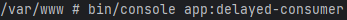
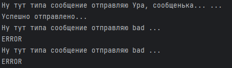

## Примеры работы с консюмерами
### Example 1
> Базовый пример.

Запускаем наш consumer и говорим слушать:

Отправляем ему сообщение через команду.
> P.S. С помощью producer

consumer его получил:

Убеждаемся в этом в UI кролика:

### Example 2
> Отложенная отправка сообщений.

Запускаем соответствующий consumer:

Отправляем сообщение:

Что у consumer?

consumer получил успешное сообщение и ошибку, которая теперь будет бесконечно приходить.